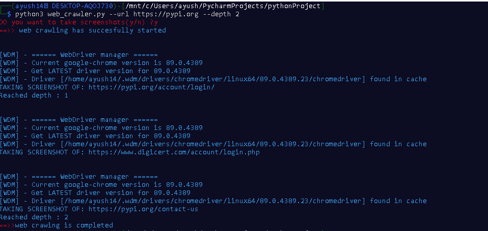

#                                                                  WEB  CRAWLER
This is my project which can crawl a given url or domain and collect the desired information from the website.

## TECH STACK : 
1. Python 
2. WEB Libraries like Beautifulsoup , SELENIUM , REQUESTS , REGEX LIBRARY , SHUTIL , ARGPARSE, RANDOM, WEBDRIVER_MANAGER.CHROME, COLORAMA.
## DETAILS :
* Main Script consist of complete_web_crawler.py
* Rest script are the parts of my program showing the functions that are used in the main script.
## INSTALLING LIBRARIES :
1. [BeautifulSoup](https://pypi.org/project/beautifulsoup4/)
2. [SELENIUM](https://pypi.org/project/selenium/)
3. [REQUESTS](https://pypi.org/project/requests/)
4. [ARGPARSE](https://pypi.org/project/argparse/)
5. [REGEX](https://pypi.org/project/regex/)
6. [RANDOM](https://pypi.org/project/random2/)
7. [WEBDRIVER-MANAGER](https://pypi.org/project/webdriver-manager/)
8. [COLORAMA](https://pypi.org/project/colorama/)
## USAGE :
####  git clone https://github.com/AyushAjay14/Web-Crawler.git 
####  cd Web-Crawler
####  ==>>   python complete_web_crawler.py --url  --depth  --emails --headers --phoneno --imagelinks 
* --url ```<provide the desired URL >``` 
* --depth ```<provide the required depth>```
* --emails ```<if 1 is supplied then crawler will search for mails also and for 0 it will skip email scrapping >```
* --headers ```<if 1 is supplied then crawler will search for headers also and for 0 it will skip >```
* --phoneno ```<if 1 is supplied then crawler will search for phone numbers also and for 0 it will skip>```
* --imagelinks ```<if 1 is supplied then crawler will search for image links also and for 0 it will skip>```
* ``` By default if any of the options is not provided then the option will be set to 1 ```
### EXAMPLE :
* python complete_web_crawler.py --url https://ctftime.org --depth 1 --headers 1 --phoneno 1 --imagelinks 0
## SCREENSHOT :
* *** In order to make screenshot function work properly you need to install google chrome in your virtual machine
* Commands are:
######         wget https://dl.google.com/linux/direct/google-chrome-stable_current_amd64.deb
######         sudo apt install ./google-chrome-stable_current_amd64.deb
######         Ensure it worked:
######         google-chrome --version
## ERRORS :
* If you are using wsl2 and getting the following error - 

``` Then follow the methods given here - https://www.gregbrisebois.com/posts/chromedriver-in-wsl2/```
## SNIPPETS :


